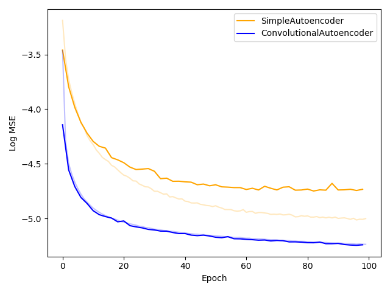
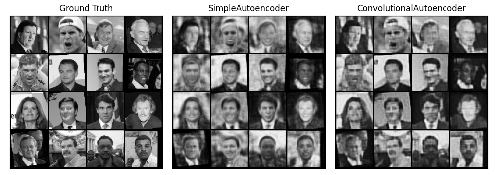

<!--
mlpi
title: A Better Autoencoder for Image: Convolutional Autoencoder
category: architectures/autoencoders
images: images/losses.png, images/reconstruction.png

-->

<h1 align="center">Convolutional Autoencoder</h1>
Pytorch implementation of "A Better Autoencoder for Image: Convolutional Autoencoder" by Yifei Zhang

## Methods
A **simple autoencoder (SAE)** consisting of 3 layers (input, latent, output) was compared against the **convolutional autoencoder (CAE)** architecture
proposed in [1] using the Labeled Faces in the Wild (LFW) dataset. The images were resized to be 64x64 pixels and converted to grayscale.
For the image compression/reconstruction task, both models were trained for 100 epochs with a learning rate of `0.001`, using the original 
images as the ground truth and `MSELoss` as the loss function.

## Results

    

The results were consistent with those found in [1]. The CAE achieves a significantly lower loss compared to the SAE.
(The darker lines represent test loss whereas the lighter lines represent training loss.)

This improvement is also evident in the reconstruction of images from the test set:

    

Although the SAE reconstructions may appear to be sharper, careful inspection reveals that the reconstructed faces are completely
different from the ground truths. On the other hand, while the CAE reconstructions look less sharp, the defining features and shadows on each person's face
are accurately reconstructed, which makes the CAE reconstructions look far more convincing. It is also interesting to note that the backgrounds of the CAE images are far sharper than those of the SAE images.

## References
[[1](http://users.cecs.anu.edu.au/~Tom.Gedeon/conf/ABCs2018/paper/ABCs2018_paper_58.pdf)] Yifei Zhang. _A Better Autoencoder for Image: Convolutional Autoencoder_.
